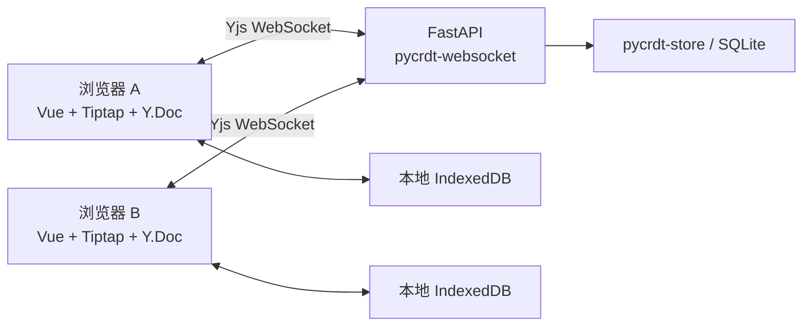

# 基于 DOM 的协同编辑器

一个用于学习与演示协作编辑的轻量项目：两个人打开同一个链接，可以在**同一段文字里同时输入**，看到彼此的文字光标、选区和鼠标位置。适合共同写笔记、会议记录、草稿等文本内容。

前端采用 **Vue 3 + TypeScript + Tiptap / ProseMirror**，正文通过 DOM / `contenteditable` 渲染；后端采用 **Python + FastAPI**。Yjs / pycrdt 处理并发合并，现成库负责同步与持久化。

[快速开始](#快速开始windows) · [操作说明](#怎么使用) · [局域网运行](#局域网运行) · [核心代码](#核心代码) · [测试](#测试) · [限制](#当前限制)

## 能做什么

| 能力 | 当前行为 |
| --- | --- |
| 文本编辑 | 输入、修改、删除、分段、段内换行、纯文本粘贴 |
| 同段协作 | 多人同时改同一段，自动合并，恢复连接后继续同步 |
| 文字光标与选区 | 显示其他人的输入位置、文字选择和自动生成的访客名 |
| 远端鼠标 | 显示对方在实际段落范围内的大致位置 |
| 整段选择 | 从正文左侧留白拖动选择段落，其他人能看到选中高亮 |
| 批量操作 | 复制或删除选中的段落，整批删除可一次撤销 |
| Undo / Redo | 撤销、重做本会话自己的编辑，不撤销别人独立完成的编辑 |
| 本地恢复与服务端保存 | 浏览器 IndexedDB 缓存；服务端 SQLite 存储 |
| 离线编辑 | 已打开的文档断线后可继续编辑，重连后自动合并 |
| 离线刷新与备份 | 构建版在安全上下文缓存页面资源；支持导出和合并 JSON 备份 |

目前正文是**纯文本 + 段落**，没有图片、表格、附件、富文本样式或 Markdown 渲染。输入 Markdown 符号会按普通文字显示。

## 快速开始（Windows）

以下命令在 **PowerShell 7** 中执行。建议使用 **Node.js 24.x、Python 3.12、uv**，并安装 Git。依赖版本已锁定，不需要重新生成锁文件。

### 1. 克隆并安装依赖

```powershell
git clone https://github.com/TheAatroxking1/dom-collaborative-editor.git
cd dom-collaborative-editor

uv venv --python 3.12 backend/.venv
uv pip sync --python backend/.venv/Scripts/python.exe --require-hashes backend/requirements.lock
npm --prefix frontend ci
```

下面的命令都从**仓库根目录**运行。依赖安装需要联网；正常使用不依赖第三方协作服务。

### 2. 构建并启动

```powershell
npm --prefix frontend run build
pwsh -File scripts/serve.ps1
```

打开 **<http://127.0.0.1:5274>**。一个 Python 进程同时提供网页、HTTP API 和 WebSocket。终端保持运行，按 **Ctrl+C** 正常停止，留意终端是否出现停机或保存错误。

### 3. 体验双人编辑

1. 点击「新建文档」，输入几行文字。
2. 点击「复制协作链接」，用另一个浏览器或隐私窗口打开。
3. 两边在同一段输入不同内容，观察文字同步和协作者光标。
4. 在一边选中文字，或者从正文左侧留白拖动选择几段，观察另一边的高亮。
5. 删除所选段落，再点「撤销」，确认整批恢复。

同一浏览器的两个标签页也支持，但它们共享站点存储。验证独立设备的恢复行为时，使用不同浏览器、独立配置文件或真实第二台设备。

**GitHub 仓库提供源码，不是已部署的在线编辑器；GitHub Pages 也不能运行这里的 Python 同步服务。**

## 怎么使用

| 操作 | 方法 |
| --- | --- |
| 新建段落 | Enter |
| 同一段内换行 | Shift+Enter |
| 选择文字 | 在正文文字区域拖动 |
| 选择整段 | 在正文**左侧留白**按下鼠标并拖动，不需要切换模式 |
| 清除整段选择 | 点击正文或选区外，或按 Escape |
| 复制整篇 | 点击「复制正文」 |
| 复制选中的段落 | 点击「复制所选段落」，或 Ctrl/Cmd+C |
| 删除选中的段落 | 点击「删除所选段落」，或 Delete / Backspace |
| 撤销 / 重做 | 工具栏按钮；Ctrl/Cmd+Z、Ctrl/Cmd+Shift+Z（Windows 也支持 Ctrl+Y） |
| 保存可携带副本 | 页面底部「备份与迁移」→「导出当前正文」 |
| 再次打开文档 | 保存或收藏协作链接，目前没有文档列表 |

文字选择与整段选择是两种交互。整段选择不会锁住段落，其他人仍可编辑；复制、删除针对**执行操作时的最新内容**。窄窗口中工具栏可横向滚动。

如果浏览器不允许访问剪贴板，页面会显示可手动复制的文字或链接。

## 局域网运行

只有提供服务的电脑需要安装项目。完成上面的安装与构建后，在该电脑执行：

```powershell
pwsh -File scripts/serve.ps1 -HostAddress 0.0.0.0 -Port 5274
```

用 `ipconfig` 查看这台电脑当前网卡的 IPv4 地址。假设是 `192.168.1.100`，所有设备统一访问：

```text
http://192.168.1.100:5274
```

在这个地址新建文档并分享链接。**不要把包含 `127.0.0.1`、`localhost` 或 `0.0.0.0` 的地址发给另一台设备**；前两者指向访问者自己，后者是监听地址。

设备需处于可互通的网络，服务电脑保持运行；连接失败时检查 Windows 防火墙的专用网络入站规则、路由器访客隔离、VPN 和端口占用。

| 使用环境 | 在线协作 | 已打开页面断线后继续编辑 | 整站离线后刷新 |
| --- | --- | --- | --- |
| 开发版（5273） | 支持 | 支持 | 不提供页面离线缓存 |
| 本机构建版（127.0.0.1:5274） | 支持 | 支持 | 页面资源与该文档已缓存后可用 |
| 局域网 HTTP 构建版 | 支持 | 支持 | 不保证，通常无法重新加载页面 |
| 局域网可信 HTTPS 构建版 | 支持 | 支持 | 页面资源与该文档已缓存后可用 |

可信 HTTPS 配置、排障和换地址迁移见 [本地与局域网指南](docs/local-and-lan.md)。不要在编辑过程中随意更换协议、主机名或端口：浏览器按地址来源隔离本地数据，未同步内容应先导出备份。

## 开发模式（5273）

需要修改前端并热更新时，开两个 PowerShell 终端，在仓库根目录分别运行：

```powershell
# 终端 A：后端
backend/.venv/Scripts/python.exe -m uvicorn app.main:app --app-dir backend --host 127.0.0.1 --port 8787 --workers 1 --timeout-graceful-shutdown 10
```

```powershell
# 终端 B：前端
npm --prefix frontend run dev
```

打开 **<http://127.0.0.1:5273>**。前端开发服务器代理 API / WebSocket 到 8787。分别在各自终端按 Ctrl+C 停止。

也可以用 `pwsh -File scripts/dev.ps1` 一键启动，但该脚本退出时会强制结束自己启动的子进程，不能用于验证正常停机保存。

开发版和构建版使用不同端口，以免生产 Service Worker 的页面缓存接管开发页面。**切换模式前先停止另一个后端；不能让两个服务进程使用同一数据目录。**

## 同步、保存和备份



- **并发合并**：Yjs / pycrdt 维护共享正文；不用段落锁限制同段输入。
- **断线重连**：`y-websocket` 重新交换状态并补齐变化；本项目不维护自定义 ACK 或重发队列。
- **本地缓存**：`y-indexeddb` 恢复当前浏览器中的文档，再连接服务端。
- **服务端保存**：`pycrdt-store` 写 SQLite；应用在正常停机流程中额外写入完整状态。
- **协作者状态**：光标、鼠标、选区使用 Awareness，属于临时信息，不进入正文、数据库或备份。

**「已连接」表示 WebSocket 已连接，不是每次输入已写入磁盘的凭证。** 页面显示修改、另一端看到修改、服务端落盘是不同阶段；突然断电、强制结束进程或清除浏览器存储，可能影响尚未保存的修改。

| 位置 | 内容 |
| --- | --- |
| `backend/data/v2/documents.sqlite3` | 文档 ID 与创建时间 |
| `backend/data/v2/updates.sqlite3` | 正文的 CRDT 更新 |
| 浏览器 IndexedDB：`dom-collab-v2:<documentId>` | 当前地址下的本地副本 |

服务端整体备份：**正常停止后复制整个数据目录**，不要只复制运行中的某一个 SQLite 文件。数据库、本地证书、依赖和个人导出的备份文件都已加入 Git 忽略规则。

页面里的 JSON 备份支持离线导出、只读预览，以及对**同一文档 ID**合并。合并需要当前服务器上存在该文档；它是 CRDT 合并，**不是恢复历史版本**。换到空服务器时，应迁移整个服务端数据目录，或者将备份预览里的纯文本复制到新文档。

## 核心代码

阅读顺序可以从 `EditorPane.vue → session.ts → main.py → collaboration.py` 开始，再看交互模块。

| 文件 | 职责 |
| --- | --- |
| [frontend/src/App.vue](frontend/src/App.vue) | 文档入口、链接路由、状态提示 |
| [frontend/src/editor/EditorPane.vue](frontend/src/editor/EditorPane.vue) | 组装编辑器、工具栏、粘贴、撤销与覆盖层 |
| [frontend/src/editor/extensions.ts](frontend/src/editor/extensions.ts) | 最小段落 schema、协作历史与文字光标 |
| [frontend/src/documents/session.ts](frontend/src/documents/session.ts) | Y.Doc、网络与本地缓存的生命周期 |
| [backend/app/main.py](backend/app/main.py) | FastAPI 路由、WebSocket 入口、静态页面 |
| [backend/app/collaboration.py](backend/app/collaboration.py) | 房间恢复、库组装、初始 Awareness、停机写回 |
| [backend/app/documents.py](backend/app/documents.py) | 文档目录与唯一初始正文 |
| [frontend/src/editor/paragraphs.ts](frontend/src/editor/paragraphs.ts) | 稳定段落引用与 DOM 测量 |
| [frontend/src/editor/presence.ts](frontend/src/editor/presence.ts) | 访客身份与远端鼠标 |
| [frontend/src/editor/paragraphSelection.ts](frontend/src/editor/paragraphSelection.ts) | 留白拖动、整段高亮、批量复制与删除 |

其他辅助代码：`frontend/src/documents/backup.ts` 与 `DocumentBackup.vue` 处理备份；`frontend/src/offline.ts` 处理页面资源缓存；`frontend/src/clipboard.ts` 处理剪贴板结果。测试放在 `backend/tests`、`frontend/tests`、`frontend/e2e` 与 `frontend/e2e-production`。

## 配置

| 配置 | 默认值 | 说明 |
| --- | --- | --- |
| `COLLAB_DATA_DIR` | `backend/data/v2` | 服务端数据目录；相对路径基于启动时的工作目录 |
| `COLLAB_STATIC_DIR` | 未设置 | 静态构建目录；`serve.ps1` 自动指向 `frontend/dist` |
| `COLLAB_BACKEND_URL` | `http://127.0.0.1:8787` | Vite 开发代理目标 |
| `COLLAB_DEV_PORT` | `5273` | Vite 开发端口 |
| `PLAYWRIGHT_CHROMIUM_PATH` | 未设置 | 测试使用的本机 Chromium / Chrome 可执行文件 |

例如在 PowerShell 指定独立数据目录：

```powershell
$env:COLLAB_DATA_DIR = 'D:\collab-data'
pwsh -File scripts/serve.ps1 -Port 5274
```

配置通过进程环境变量读取，不自动加载仓库根目录的 `.env`。后端仅支持 **1 个 Uvicorn worker**。

## 测试

只运行应用不需要安装测试浏览器。运行完整验证前，先安装 Playwright Chromium：

```powershell
npm --prefix frontend exec -- playwright install chromium
pwsh -File scripts/verify.ps1
```

下载受限时可以使用本机已有的 Chrome：

```powershell
$env:PLAYWRIGHT_CHROMIUM_PATH = 'C:\Program Files\Google\Chrome\Application\chrome.exe'
pwsh -File scripts/verify.ps1
```

验证按顺序执行：后端 pytest → 前端 Vitest → 类型检查 → 构建 → 开发版端到端测试 → 构建版端到端测试，任一步失败即停止。端到端测试使用临时数据目录，不修改日常使用的文档。

默认测试端口为前端 5473、后端 8791、构建版 5483，可分别通过 `COLLAB_E2E_FRONTEND_PORT`、`COLLAB_E2E_BACKEND_PORT`、`COLLAB_E2E_PRODUCTION_PORT` 调整。

单独运行：

```powershell
backend/.venv/Scripts/python.exe -m pytest -c backend/pyproject.toml backend/tests -q
npm --prefix frontend test
npm --prefix frontend run typecheck
npm --prefix frontend run test:e2e
npm --prefix frontend run build
npm --prefix frontend run test:e2e:production
```

## 当前限制

- **适用范围**：本机或可信局域网演示。没有账号、鉴权、访问权限、容量配额和文档管理后台；知道链接的人可以编辑。不要直接暴露到公网。
- **鼠标范围**：当前只在实际段落矩形内显示，包括 Enter 创建的空段落；段间间距和正文下方剩余空白不显示。全编辑区覆盖已记录为[后续调整](docs/2026-09-24-follow-up-decisions.md)，尚未实现。不同窗口宽度下鼠标位置是近似的，文字光标才精确跟随文本。
- **触屏**：没有实现触屏整段框选，保留原生文字编辑。
- **撤销历史**：只属于当前会话，刷新后不保留；没有文档历史版本或回滚。
- **离线条件**：必须先访问过页面和该文档并完成缓存；第一次离线访问、清除站点数据后或换浏览器后，不能凭空恢复正文。
- **验证范围**：自动化主要使用 Windows + Chromium 的独立浏览器上下文；不能代替真实双设备局域网、持续弱网及系统中文输入法人工验收。见[中文输入法检查表](docs/manual-ime-checklist.md)和[已有离线验收记录](docs/offline-lan-validation.md)。
- **旧数据**：早期自研协议的 `backend/data/` 数据与当前 `v2/` 不兼容，没有自动迁移。
- **Python 侧正文操作**：服务端只接收和保存二进制更新；不要直接按 Python 字符下标改正文，emoji 等非 BMP 字符与 Yjs 的索引单位不同。

更多说明：[文档导航](docs/README.md) · [演示步骤](docs/demo.md) · [局域网与迁移](docs/local-and-lan.md)。历史设计中的本机路径与分支状态不适用于 GitHub 克隆目录，当前行为以源码、测试和本 README 为准。
