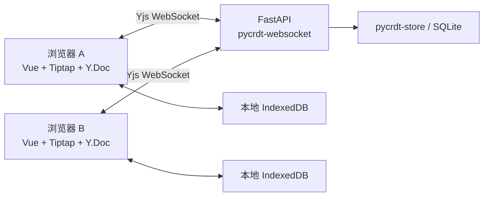

# 基于 DOM 的协同编辑器

一个用于学习与演示协作编辑的轻量项目：两个人打开同一个链接，可以在**同一段文字里同时输入**，看到彼此的文字光标、选区和鼠标位置。适合共同写笔记、会议记录、草稿等文本内容。

前端采用 **Vue 3 + TypeScript + Tiptap / ProseMirror**，正文通过 DOM / `contenteditable` 渲染；后端采用 **Python + FastAPI**。Yjs / pycrdt 处理并发合并，现成库负责同步与持久化。

[Windows 启动](#快速开始windows) · [macOS 启动](#快速开始macos) · [操作说明](#怎么使用) · [局域网运行](#局域网运行) · [核心代码](#核心代码) · [测试](#测试) · [开发经历](#开发经历与思考)

## 项目说明导读

| 想了解的问题 | 对应内容 |
| --- | --- |
| 1. 项目怎么运行？ | [Windows 一键安装与启动](#快速开始windows)、[macOS 启动](#快速开始macos)；构建版默认使用 5274 端口，开发版使用 5273 |
| 2. 使用了什么技术？ | [技术选型与分工](#技术选型与分工)：Vue、Tiptap、FastAPI 与现成的协作、存储库 |
| 3. 数据结构怎么设计？ | [数据结构与设计取舍](#数据结构与设计取舍)：段落文档、稳定引用，以及正文和临时状态的分离 |
| 4. 协同怎么实现？ | [同步、保存和备份](#同步保存和备份)：本地编辑、增量同步、并发合并、断线恢复 |
| 5. 遇到了什么问题？ | [遇到的问题与处理](#遇到的问题与处理)：自研逻辑过多、安装门槛、局域网分享和鼠标定位 |
| 6. 还有哪些没有完成？ | [当前限制](#当前限制)：鉴权、审计、富文本、大规模并发和平台验收 |
| 7. 如果继续开发，准备怎么优化？ | [后续开发方向](#后续开发方向)：需求讨论、管理能力、性能测量和内容扩展 |

## 能做什么

| 能力 | 当前行为 |
| --- | --- |
| 文本编辑 | 输入、修改、删除、分段、段内换行、纯文本粘贴 |
| 同段协作 | 多人同时改同一段，自动合并，恢复连接后继续同步 |
| 文字光标与选区 | 显示其他人的输入位置、文字选择和自动生成的访客名 |
| 远端鼠标 | 显示对方在整个正文编辑区内的大致位置，包含空文档和留白 |
| 整段选择 | 从正文左侧留白拖动选择段落，其他人能看到选中高亮 |
| 批量操作 | 复制或删除选中的段落，整批删除可一次撤销 |
| Undo / Redo | 撤销、重做本会话自己的编辑，不撤销别人独立完成的编辑 |
| 本地恢复与服务端保存 | 浏览器 IndexedDB 缓存；服务端 SQLite 存储 |
| 离线编辑 | 已打开的文档断线后可继续编辑，重连后自动合并 |
| 离线刷新与备份 | 构建版在安全上下文缓存页面资源；支持导出和合并 JSON 备份 |

目前正文是**纯文本 + 段落**，没有图片、表格、附件、富文本样式或 Markdown 渲染。输入 Markdown 符号会按普通文字显示。

## 快速开始（Windows）

### 一键安装与启动（推荐）

适用于已更新的 **Windows 10 / 11**（Python Install Manager 至少需要 Windows 10 21H2，系统内部版本 19044）。无需预先安装 Git、uv、PowerShell 7（`pwsh`）或 winget。

1. 在 [GitHub 仓库](https://github.com/TheAatroxking1/dom-collaborative-editor) 点击 **Code → Download ZIP**，将 ZIP **完整解压**到一个可写目录；不要在压缩包内直接运行。
2. 双击根目录的 **`install.bat`**，保持联网并等到安装与构建完成。缺少 Python 时，会调用官方 Python Install Manager 安装流程；若系统要求确认安装，请允许。
3. 双击 **`start.bat`**；服务就绪后会自动打开局域网页面。若终端列出多个网卡地址，先输入双方设备可访问的地址编号并回车。

创建文档后点击「复制协作链接」，可分享给同一可互通网络里的另一台电脑，对方只需要浏览器。没有检测到私网 IPv4 时，终端会明确提示并回退到本机地址 `127.0.0.1`；该地址不能供另一台电脑访问。详细条件见[局域网运行](#局域网运行)。

安装脚本会复用现有的 Node.js 24 和 Python 3.12。缺少合适的 Node.js 时，从 [Node.js 官方发布目录](https://nodejs.org/dist/)下载 24.x ZIP，核对官方 SHA-256 清单后解压到项目的 `.tools`；缺少 Python 3.12 时，通过[官方 Python Install Manager](https://docs.python.org/3/using/windows.html#advanced-installation)安装。Python Manager 及其管理的 Python 属于当前 Windows 用户，项目依赖则装入 `backend/.venv` 和 `frontend/node_modules`。脚本不永久修改系统 PATH。

安装失败时查看根目录 **`install.log`**，修复网络或安装错误后可再次运行 `install.bat`。后续启动只需 `start.bat`；更新项目源码时先停止服务，重新运行 `install.bat` 安装依赖并构建，再运行 `start.bat` 使更改生效。启动后保持窗口运行，按 **Ctrl+C** 正常停止，留意停机或保存错误。如果随后出现“终止批处理作业 (Y/N)?”，输入 `Y` 结束窗口中的批处理。

批处理使用 Windows 自带的 PowerShell 5.1；执行策略设置只作用于本次 PowerShell 进程，不修改系统或用户的执行策略。批处理结束后会暂停，避免错误窗口闪退；命令行自动化可将 `--no-pause` 放在第一个参数位置，例如：

```powershell
.\install.bat --no-pause
.\start.bat --no-pause -NoBrowser -Port 5274
```

`-NoBrowser` 禁止自动打开浏览器和交互选择，只在终端显示候选访问地址；适合自动化。也可用 `-BrowserHost 192.168.1.100` 指定打开的服务电脑 IP，替换成实际地址。两者不能同时使用。

已在 Windows PowerShell 5.1 下验证全新项目目录的依赖安装与构建、Node.js 官方 ZIP 下载校验、重复安装保留数据及 BAT 启动；当前尚未在全新 Windows 真机上完成从零安装所有工具的全流程验收。受管理的电脑若禁止 MSIX 安装，可使用下方手动路线并按单位规定安装工具。

### 手动安装

以下命令在 Windows 自带的 **PowerShell 5.1** 或 PowerShell 7 中执行。选择手动路线时，先安装以下三个工具，安装完成后重新打开终端：

| 工具 | 用途 | 安装来源 |
| --- | --- | --- |
| Git | 克隆仓库 | [Git 官网](https://git-scm.com/install/windows) |
| Node.js 24.x（含 npm） | 构建前端 | [Node.js 官网](https://nodejs.org/en/download)，选择 24.x |
| Python 3.12 | 运行后端 | [Python 官方安装器](https://www.python.org/downloads/windows/)，安装步骤见下方 |

### 0. 安装 Python 并检查环境

如果 `py -3.12 --version` 已能显示 `Python 3.12.x`，跳过安装。尚未安装 Python 的 Windows 10/11 电脑，先在 PowerShell 执行以下命令安装 **Python Install Manager**（此时不需要进入项目目录）：

```powershell
winget install 9NQ7512CXL7T -e
```

如果 `winget` 无法识别或商店安装失败，打开 [Python 官方安装器页面](https://www.python.org/downloads/release/pymanager-263/)，点击 **Download Installer (MSIX)**，下载后双击安装即可。

安装器完成后，**关闭原来的 PowerShell，重新打开**，再安装本项目需要的 Python 3.12 并确认版本：

```powershell
pymanager install 3.12
py -3.12 --version
```

应显示 `Python 3.12.x`；只安装管理器还不等于已安装项目要求的 3.12。安装命令明确使用 `pymanager`，因为旧版 Python Launcher 也叫 `py`，但不支持 `py install`。如果 `pymanager` 也无法识别，先确认上面的 Python Install Manager 已安装，并重新打开终端。命令与安装器说明见 [Python 官方 Windows 指南](https://docs.python.org/3/using/windows.html)。

然后确认其余环境，以下四条命令都应显示版本；某一步报错时先解决该错误，再继续安装项目依赖：

```powershell
git --version
node --version
npm --version
py -3.12 --version
```

**不需要安装 uv 或 PowerShell 7。** 默认使用 Python 自带的 `venv` 和 `pip`；依赖版本已锁定，不需要重新生成锁文件。若没有 `py`，但 `python --version` 显示 3.12.x，可将下面的 `py -3.12` 换成 `python`；其他版本不应直接替代。

### 1. 克隆并安装依赖

```powershell
git clone https://github.com/TheAatroxking1/dom-collaborative-editor.git
cd dom-collaborative-editor

py -3.12 -m venv backend/.venv
.\backend\.venv\Scripts\python.exe -m pip install --require-hashes -r backend/requirements.lock
npm --prefix frontend ci
```

下面的命令都从**仓库根目录**运行。依赖安装需要联网；正常使用不依赖第三方协作服务。

如果正在按旧说明操作并遇到“无法识别 uv”，直接用上面的两条 Python 命令替代原来的两条 uv 命令即可。已安装 uv 的用户仍可用 `uv venv` / `uv pip sync` 安装同一份锁文件，它是可选工具。

### 2. 构建并启动

```powershell
npm --prefix frontend run build
powershell.exe -NoProfile -File scripts/serve.ps1
```

服务就绪后自动打开局域网页面；若有多个候选地址，先在终端输入编号。一个 Python 进程同时提供网页、HTTP API 和 WebSocket。终端保持运行，按 **Ctrl+C** 正常停止，留意终端是否出现停机或保存错误。

**如果此前使用 `pwsh -File scripts/serve.ps1` 提示“无法识别 pwsh”**，只需换成上面的 `powershell.exe` 命令，不用重新安装依赖或构建。`pwsh` 是另外安装的 PowerShell 7 的命令名；本项目的脚本兼容 Windows 自带的 PowerShell 5.1。已安装 PowerShell 7 时，原 `pwsh` 命令仍可使用。

### 3. 体验双人编辑

1. 点击「新建文档」，输入几行文字。
2. 点击「复制协作链接」，用另一个浏览器、隐私窗口或同一可互通网络的另一台电脑打开；若出现多个地址，先选择可访问的网卡地址。
3. 两边在同一段输入不同内容，观察文字同步和协作者光标。
4. 在一边选中文字，或者从正文左侧留白拖动选择几段，观察另一边的高亮。
5. 删除所选段落，再点「撤销」，确认整批恢复。

同一浏览器的两个标签页也支持，但它们共享站点存储。验证独立设备的恢复行为时，使用不同浏览器、独立配置文件或真实第二台设备。

**GitHub 仓库提供源码，不是已部署的在线编辑器；GitHub Pages 也不能运行这里的 Python 同步服务。**

## 快速开始（macOS）

在 macOS 的「终端」中执行，使用系统自带的 zsh / sh，**不需要 PowerShell 或 uv**。先准备 Git、Node.js 24.x（含 npm）和 Python 3.12；用 `python3.12 --version` 确认版本。工具安装与常见问题见 [macOS 运行指南](docs/macos.md)。

```sh
git clone https://github.com/TheAatroxking1/dom-collaborative-editor.git
cd dom-collaborative-editor

python3.12 -m venv backend/.venv
backend/.venv/bin/python -m pip install --require-hashes -r backend/requirements.lock
npm --prefix frontend ci
npm --prefix frontend run build
sh scripts/serve.sh
```

服务就绪后自动打开局域网页面；若有多个候选地址，先在终端输入编号。分享方式见下方[局域网运行](#局域网运行)。终端保持运行，按 **Control+C** 正常停止。后续启动只需要最后一条命令；更新源码时先停止服务，重新构建前端并重启服务。无人值守时使用 `sh scripts/serve.sh --no-browser`；指定打开的 IP 可用 `--browser-host 192.168.1.100`，两者不能同时使用。

Mac 虚拟环境中的 Python 位于 `backend/.venv/bin/python`，Windows 则是 `backend/.venv/Scripts/python.exe`。请分别克隆并安装依赖，不要把 Windows 的 `.venv` 或 `node_modules` 复制到 Mac。使用 `sh scripts/serve.sh` 不需要额外执行 `chmod`。

## 怎么使用

| 操作 | 方法 |
| --- | --- |
| 新建段落 | Enter |
| 同一段内换行 | Shift+Enter |
| 选择文字 | 在正文文字区域拖动 |
| 选择整段 | 在正文**左侧留白**按下鼠标并拖动，不需要切换模式 |
| 清除整段选择 | 点击正文或选区外，或按 Escape |
| 复制整篇 | 点击「复制正文」 |
| 复制选中的段落 | 点击「复制所选段落」，或 Ctrl/Cmd+C |
| 删除选中的段落 | 点击「删除所选段落」，或 Delete / Backspace |
| 撤销 / 重做 | 工具栏按钮；Ctrl/Cmd+Z、Ctrl/Cmd+Shift+Z（Windows 也支持 Ctrl+Y） |
| 保存可携带副本 | 页面底部「备份与迁移」→「导出当前正文」 |
| 再次打开文档 | 保存或收藏协作链接，目前没有文档列表 |

文字选择与整段选择是两种交互。整段选择不会锁住段落，其他人仍可编辑；复制、删除针对**执行操作时的最新内容**。窄窗口中工具栏可横向滚动。

如果浏览器不允许访问剪贴板，页面会显示可手动复制的文字或链接。

## 局域网运行

只有提供服务的电脑需要安装项目。Windows 的 `start.bat` / `scripts/serve.ps1`、macOS 的 `scripts/serve.sh` 默认监听 **`0.0.0.0:5274`**，服务就绪后打开检测到的局域网 IP；只有一个候选地址时自动使用，多个地址时先在终端选择编号。没有候选地址时明确提示并回退 `127.0.0.1`。开发前端仍默认监听 **`0.0.0.0:5273`**，不使用构建版的自动打开流程。`0.0.0.0` 表示接受各网卡的连接，不是浏览器访问地址。

自动化或没有可输入终端时，使用 Windows 的 `-NoBrowser` / Mac 的 `--no-browser`，只显示候选地址而不选择、不打开；也可以用 `-BrowserHost 实际IP` / `--browser-host 实际IP` 指定浏览器地址。两组参数互斥，指定浏览器地址不会改变服务监听范围。

在文档中点击「复制协作链接」：

- 从 `localhost` / `127.0.0.1` 页面分享时，应用向服务端 `/api/share-addresses` 获取私网 IPv4，用选定的地址生成同一文档的链接；有多个候选地址时，需要选择双方能访问的地址。
- 如果页面已经通过局域网 IP 或域名打开，分享保留当前协议、主机和端口。
- 生成链接不会跳转当前页面，也不会改变当前文档的浏览器存储来源。未找到地址或请求失败时，按页面提示检查网络或手动使用已知的服务地址。

例如服务电脑地址为 `192.168.1.100`，另一台设备使用的链接以 `http://192.168.1.100:5274` 开头，并保留当前文档标识。地址不确定时，Windows 用 `ipconfig` 查看当前网卡 IPv4；Mac 在「系统设置 → 网络 → 当前连接的详细信息 → TCP/IP」查看。**不要把含 `127.0.0.1`、`localhost` 或 `0.0.0.0` 的链接发给另一台设备。**

设备需处于可互通的网络，服务电脑保持运行。自动列出地址不保证对方能连接；检查服务电脑的防火墙入站规则、路由器访客隔离、VPN 和端口占用。脚本不会自动修改防火墙。

只想允许本机访问时，显式指定回环地址。Windows：

```powershell
powershell.exe -NoProfile -File scripts/serve.ps1 -HostAddress 127.0.0.1 -Port 5274
```

macOS：

```sh
sh scripts/serve.sh --host 127.0.0.1 --port 5274
```

开发前端仅本机访问可使用 `npm --prefix frontend run dev -- --host 127.0.0.1`。仅监听回环地址时，生成局域网链接也不会让其他设备连进来。

| 使用环境 | 在线协作 | 已打开页面断线后继续编辑 | 整站离线后刷新 |
| --- | --- | --- | --- |
| 开发版（5273） | 支持 | 支持 | 不提供页面离线缓存 |
| 本机构建版（127.0.0.1:5274） | 支持 | 支持 | 页面资源与该文档已缓存后可用 |
| 局域网 HTTP 构建版 | 支持 | 支持 | 不保证，通常无法重新加载页面 |
| 局域网可信 HTTPS 构建版 | 支持 | 支持 | 页面资源与该文档已缓存后可用 |

**默认打开的 HTTP 局域网地址不是安全上下文，不能进行整站离线刷新。** 要使用该功能，需配置可信 HTTPS，证书覆盖打开或分享时选用的 IP / 域名，并被访问设备信任。配置、排障和换地址迁移见 [本地与局域网指南](docs/local-and-lan.md)。

如果以前在 `http://127.0.0.1:5274` 或 `localhost` 下编辑过，切换到默认局域网地址前，先回到原地址让未同步内容完成同步，或导出备份；不同地址的浏览器本地缓存互不共享。更新功能后需要重新构建前端并重启服务；有旧页面缓存时，结束编辑后关闭全部页面再重新打开。

## 开发模式（5273）

需要修改前端并热更新时，开两个终端，在仓库根目录分别运行。Windows 后端命令：

```powershell
# 终端 A：后端
backend/.venv/Scripts/python.exe -m uvicorn app.main:app --app-dir backend --host 127.0.0.1 --port 8787 --workers 1 --timeout-graceful-shutdown 10
```

macOS 后端命令：

```sh
backend/.venv/bin/python -m uvicorn app.main:app --app-dir backend --host 127.0.0.1 --port 8787 --workers 1 --timeout-graceful-shutdown 10
```

另一个终端启动前端（两种系统相同）：

```powershell
# 终端 B：前端
npm --prefix frontend run dev
```

打开 **<http://127.0.0.1:5273>**。前端默认监听所有 IPv4 网卡，可通过局域网地址访问；API / WebSocket 由 Vite 代理到仅监听本机的 8787，其他设备不需要直连后端端口。分别在各自终端按 Ctrl+C 停止。

Windows 也可以用 `powershell.exe -NoProfile -File scripts/dev.ps1` 一键启动，但该脚本退出时会强制结束自己启动的子进程，不能用于验证正常停机保存。

开发版和构建版使用不同端口，以免生产 Service Worker 的页面缓存接管开发页面。**切换模式前先停止另一个后端；不能让两个服务进程使用同一数据目录。**

## 技术选型与分工

选型的主要目标是：使用熟悉的 Vue 和 Python，优先复用已有库，把项目代码集中在界面、库的集成和实际使用边界上。

| 层次 | 技术 | 在本项目中的职责 |
| --- | --- | --- |
| 页面与交互 | Vue 3、TypeScript | 文档入口、工具栏、连接状态、备份与协作覆盖层 |
| DOM 编辑内核 | Tiptap / ProseMirror | 文档 schema、输入与选区、事务、DOM / `contenteditable` 渲染 |
| 并发数据模型 | Yjs（浏览器）、pycrdt（Python） | 维护共享正文，处理并发更新与合并 |
| 浏览器网络同步 | y-websocket | 连接协作房间、交换更新、断线重连；提供共享的 Awareness |
| HTTP 与服务入口 | FastAPI、Uvicorn | 文档 API、WebSocket 入口、静态网页和应用生命周期 |
| Python 协作房间 | pycrdt-websocket | 接入浏览器客户端，组装房间和更新分发 |
| 服务端正文保存 | pycrdt-store 的 `SQLiteYStore` | 将 CRDT 更新保存到 SQLite，并用于恢复正文 |
| 浏览器本地保存 | y-indexeddb | 将文档缓存在 IndexedDB，恢复本地未同步内容 |
| 离线页面资源 | vite-plugin-pwa / Service Worker | 在满足安全上下文与缓存条件时，离线加载构建版页面 |

FastAPI 负责 Web 服务入口；并发合并、同步协议和正文存储由对应的协作库负责。本项目补充文档初始化、资源清理、存储错误处理、局域网分享，以及鼠标和整段选择等交互。依赖版本以 `frontend/package-lock.json` 和 `backend/requirements.lock` 为准。

## 数据结构与设计取舍

编辑器采用最小的段落文档结构，节点名称如下：

```text
doc（文档）
├── paragraph（段落）
│   ├── text（文字）
│   └── hardBreak（可选，Shift+Enter）
└── paragraph
    └── text
```

这个结构与当前的纯文本、分段、段内换行、整段选择和批量操作直接对应。正文绑定到 `Y.Doc` 中名为 `body` 的 `Y.XmlFragment`；它保存共享文档结构，浏览器 DOM 是编辑视图，不作为同步或持久化的来源。

| 数据 | 表示方式 | 选择原因 |
| --- | --- | --- |
| 文档身份与元数据 | UUID `documentId`；目录表保存 `id`、`created_at` | 用同一文档 ID 路由到同一协作房间，元数据与正文存储分开 |
| 正文 | `Y.Doc` / `body`，服务端对应 pycrdt 文档 | 同步 CRDT 更新，避免每次发送整篇 HTML 或用整段字符串覆盖 |
| 段落身份 | Yjs 相对位置生成的 `ParagraphRef`，包含 `type.client`、`type.clock`、`assoc` | 前面插入或删除段落后仍能定位原段落；不以数组下标充当身份，不额外维护一套持久 Block ID |
| 当帧布局 | 编辑器位置、节点与 DOM 测量得到的段落快照 | 仅用于当前界面的定位和绘制，窗口变化后重新测量 |
| 协作者状态 | 同一 Provider 的 Awareness | 访客名、文字选区、鼠标和整段选区属于临时信息，不写进正文或撤销历史 |

初始空段落由服务端在创建文档时生成并持久化一次。客户端先恢复本地缓存，再连接服务端；正文根结构就绪后才挂载编辑器，避免每个客户端各自插入一份默认段落。

稳定引用解决的是“仍然指向哪一段”，不是段落加锁。段落被删除或合并后，失效引用会被忽略，不会退化成选中相邻段落；其他人仍可以在被选中的段落里输入。

## 同步、保存和备份



- **并发合并**：Yjs / pycrdt 维护共享正文；不用段落锁限制同段输入。
- **断线重连**：`y-websocket` 重新交换状态并补齐变化；本项目不维护自定义 ACK 或重发队列。
- **本地缓存**：`y-indexeddb` 恢复当前浏览器中的文档，再连接服务端。
- **服务端保存**：`pycrdt-store` 写 SQLite；应用在正常停机流程中额外写入完整状态。
- **协作者状态**：光标、鼠标、选区使用 Awareness，属于临时信息，不进入正文、数据库或备份。

一次编辑的主要路径是：

1. 浏览器先恢复 IndexedDB 中的本地文档，再建立 WebSocket 连接。
2. 用户输入后，Tiptap / ProseMirror 更新本地编辑状态，通过协作扩展写入 Y.Doc，界面立即显示变化。
3. `y-indexeddb` 保存本地更新；`y-websocket` 将更新发送到 Python 协作房间，其他客户端接收并合并，服务端通过 store 保存。
4. 断网时，已经打开的文档仍可本地编辑。重连后由库交换状态、补齐缺失更新，不把某一端的整篇正文直接覆盖到另一端。

例如，两端都从 `Hello` 开始，A 在末尾输入 ` World`，B 同时输入 ` AI`。系统根据 CRDT 规则合并这些插入，而不是只保留最后上传的整段字符串。最终排列由实际编辑操作和库的合并规则决定，不能仅凭这两个最终字符串或键盘操作的时间先后来预判；涉及删除或替换时，也不保证自动满足每个人的写作意图。

Yjs 的二进制更新具有可交换、可结合和幂等的性质；各端收到相同的完整更新集合后会收敛到相同状态，重复应用同一更新不会重复插入。这些性质由库的数据结构和合并算法提供，不能只靠一个增删改队列与 `history` 去重实现。参见 [Yjs 更新机制](https://docs.yjs.dev/api/document-updates)。

协作者在线信息另走 Awareness，生命周期独立于正文；库的概念说明见 [Awareness 与 Presence](https://docs.yjs.dev/getting-started/adding-awareness)。当前自动生成的访客名仅用于区分编辑者，不是经过认证的账号身份。

**「已连接」表示 WebSocket 已连接，不是每次输入已写入磁盘的凭证。** 页面显示修改、另一端看到修改、服务端落盘是不同阶段；突然断电、强制结束进程或清除浏览器存储，可能影响尚未保存的修改。

| 位置 | 内容 |
| --- | --- |
| `backend/data/v2/documents.sqlite3` | 文档 ID 与创建时间 |
| `backend/data/v2/updates.sqlite3` | 正文的 CRDT 更新 |
| 浏览器 IndexedDB：`dom-collab-v2:<documentId>` | 当前地址下的本地副本 |

服务端整体备份：**正常停止后复制整个数据目录**，不要只复制运行中的某一个 SQLite 文件。数据库、本地证书、依赖和个人导出的备份文件都已加入 Git 忽略规则。

页面里的 JSON 备份支持离线导出、只读预览，以及对**同一文档 ID**合并。合并需要当前服务器上存在该文档；它是 CRDT 合并，**不是恢复历史版本**。换到空服务器时，应迁移整个服务端数据目录，或者将备份预览里的纯文本复制到新文档。

## 核心代码

阅读顺序可以从 `EditorPane.vue → session.ts → main.py → collaboration.py` 开始，再看交互模块。

| 文件 | 职责 |
| --- | --- |
| [frontend/src/App.vue](frontend/src/App.vue) | 文档入口、链接路由、状态提示 |
| [frontend/src/editor/EditorPane.vue](frontend/src/editor/EditorPane.vue) | 组装编辑器、工具栏、粘贴、撤销与覆盖层 |
| [frontend/src/editor/extensions.ts](frontend/src/editor/extensions.ts) | 最小段落 schema、协作历史与文字光标 |
| [frontend/src/documents/session.ts](frontend/src/documents/session.ts) | Y.Doc、网络与本地缓存的生命周期 |
| [backend/app/main.py](backend/app/main.py) | FastAPI 路由、WebSocket 入口、静态页面 |
| [backend/app/collaboration.py](backend/app/collaboration.py) | 房间恢复、库组装、初始 Awareness、停机写回 |
| [backend/app/documents.py](backend/app/documents.py) | 文档目录与唯一初始正文 |
| [frontend/src/editor/paragraphs.ts](frontend/src/editor/paragraphs.ts) | 稳定段落引用与 DOM 测量 |
| [frontend/src/editor/presence.ts](frontend/src/editor/presence.ts) | 访客身份与远端鼠标 |
| [frontend/src/editor/paragraphSelection.ts](frontend/src/editor/paragraphSelection.ts) | 留白拖动、整段高亮、批量复制与删除 |

其他辅助代码：`frontend/src/documents/backup.ts` 与 `DocumentBackup.vue` 处理备份；`frontend/src/offline.ts` 处理页面资源缓存；`frontend/src/clipboard.ts` 处理剪贴板结果。`backend/serve.py` 是 Windows/macOS 共用的启动入口，复用 `backend/app/share.py` 检测局域网地址，并在服务就绪后打开浏览器。测试放在 `backend/tests`、`frontend/tests`、`frontend/e2e` 与 `frontend/e2e-production`。

## 配置

| 配置 | 默认值 | 说明 |
| --- | --- | --- |
| `COLLAB_DATA_DIR` | `backend/data/v2` | 服务端数据目录；相对路径基于启动时的工作目录 |
| `COLLAB_STATIC_DIR` | 未设置 | 静态构建目录；`serve.ps1` / `serve.sh` 自动指向 `frontend/dist` |
| `COLLAB_BACKEND_URL` | `http://127.0.0.1:8787` | Vite 开发代理目标 |
| `COLLAB_DEV_PORT` | `5273` | Vite 开发端口 |
| `PLAYWRIGHT_CHROMIUM_PATH` | 未设置 | 测试使用的本机 Chromium / Chrome 可执行文件 |

例如在 PowerShell 指定独立数据目录：

```powershell
$env:COLLAB_DATA_DIR = 'D:\collab-data'
powershell.exe -NoProfile -File scripts/serve.ps1 -Port 5274
```

配置通过进程环境变量读取，不自动加载仓库根目录的 `.env`。后端仅支持 **1 个 Uvicorn worker**。

## 测试

只运行应用不需要安装测试浏览器。以下是 Windows 命令；macOS 的测试命令见 [macOS 运行指南](docs/macos.md#开发与测试)。运行完整验证前，先安装 Playwright Chromium：

```powershell
npm --prefix frontend exec -- playwright install chromium
powershell.exe -NoProfile -File scripts/verify.ps1
```

下载受限时可以使用本机已有的 Chrome：

```powershell
$env:PLAYWRIGHT_CHROMIUM_PATH = 'C:\Program Files\Google\Chrome\Application\chrome.exe'
powershell.exe -NoProfile -File scripts/verify.ps1
```

验证按顺序执行：后端 pytest → 前端 Vitest → 类型检查 → 构建 → 开发版端到端测试 → 构建版端到端测试，任一步失败即停止。端到端测试使用临时数据目录，不修改日常使用的文档。

默认测试端口为前端 5473、后端 8791、构建版 5483，可分别通过 `COLLAB_E2E_FRONTEND_PORT`、`COLLAB_E2E_BACKEND_PORT`、`COLLAB_E2E_PRODUCTION_PORT` 调整。

单独运行：

```powershell
backend/.venv/Scripts/python.exe -m pytest -c backend/pyproject.toml backend/tests -q
npm --prefix frontend test
npm --prefix frontend run typecheck
npm --prefix frontend run test:e2e
npm --prefix frontend run build
npm --prefix frontend run test:e2e:production
```

## 遇到的问题与处理

| 问题 | 处理与取舍 |
| --- | --- |
| 首版同步和保存的自研逻辑过多，核心流程难以 review | 用 Yjs、y-websocket、pycrdt-websocket、pycrdt-store 和 y-indexeddb 接管通用机制，项目代码负责集成与使用边界 |
| 双浏览器同步成功，仍不足以说明并发和断线行为正确 | 增加同段并发、离线修改、重连合并、删除和撤销验证；将“状态收敛”与“满足所有编辑意图”区分开 |
| 换到没有开发环境的 Windows 电脑，`pwsh`、`uv`、Python 等命令不可用 | 提供 `install.bat` / `start.bat`，复用已有合适环境，并补充 Windows 与 macOS 的手动启动路线 |
| 分享的是 `127.0.0.1`，另一台电脑无法用它访问服务 | 检测服务电脑的局域网 IP，多网卡时选择地址；默认打开局域网页面，复制保留文档标识的可访问链接 |
| 鼠标只能在部分文本区域显示，留白处不可见 | 扩展到整个正文编辑区；段落内按稳定引用定位，其他位置按编辑区比例映射 |
| 连续输入触发自动滚动后，静止鼠标沿用旧坐标 | 布局、滚动和尺寸变化后重新定位；接收端屏外隐藏，滚到对应区域后显示，双方独立滚动 |
| “已连接”容易被误认为“已持久化” | 界面只承诺连接状态；正常停机额外写回完整正文并检查结果，保存失败显式报错 |

## 开发经历与思考

以下是我的开发过程和个人验收记录。代码由 AI 辅助完成，我负责需求选择、方案取舍、阅读代码、提出问题和实际使用验证。

### 从第一版开始：先跑通，再理解

9 月 21 日下午 2 点，我正式开始准备这个项目。最初采用“Codex 写计划 → DeepSeek 实现 → Codex 审核”的方式：一方面控制成本，另一方面，当时 Codex 也在处理其他项目。后续迭代又由 Claude 参与实现和修复，Codex 协助审查、修改代码和整理文档。

大约两个小时后，第一版已经能让两个浏览器同步编辑。此前我没有做过协作编辑器，这个原型让我先看到了基本效果，但并不能回答所有问题：如果 A 写 `Hello World`，B 同时写 `Hello AI`，最后应该得到什么？如果其中一端断网，修改又会怎样处理？

我开始阅读核心代码，尝试理解数据如何从输入框传到另一端。首版注释不足，也缺少便于阅读的职责划分；这让我意识到，功能跑通之后，还需要能解释它的实现和取舍。

### 从需求出发，确定局域网场景

重新阅读招聘题目后，我把“可信局域网内，多人共同编辑文档”作为主要演示场景，希望应用和数据可以部署在本地。这是我的场景假设，并非题目已经确认的企业需求；本地部署本身也不等于已经解决了访问控制或数据安全问题。

顺着这个场景，我逐步补充了访客名、文字光标、鼠标位置和选区显示，并开始考虑断线：页面保持打开时，能否继续写？本地缓存恢复后，会不会覆盖另一位用户的修改？至于企业规模、VPN 和远程接入，我先保留为待讨论的问题，优先完成局域网协作。

### 减少自研逻辑，重新选择技术栈

继续看代码时，我发现 AI 写了大量同步与保存逻辑。按当时的粗略统计，这一部分约有 2,000 行，核心代码不含测试约有 2,800 行。这里记录的是早期版本的估计规模，不是当前版本的代码量。真正让我担心的是职责混杂、重复实现通用机制，以及后续维护和 review 的成本。

因此，我重新寻找可复用的库，结合自己更熟悉的 Vue 和 Python，确定了上面的技术分工：Tiptap 管编辑，Yjs / pycrdt 管并发模型，网络同步、服务端存储和浏览器缓存分别交给对应的库。项目仍需要集成和边界处理，但不必自行维护整套同步协议。

AI 调整方案的同时，我也在学习 CRDT。最初，我用“把增删改包装成操作、记录状态与历史、识别重复操作”来帮助自己理解同步流程。后来认识到，这只是入门模型；并发文本编辑还涉及操作身份、位置关系和一致的合并规则，不能仅靠顺序执行与去重保证收敛。当前项目使用现成的 CRDT 实现，我仍在继续学习其原理。

另一个需要分清的概念是审计。CRDT 更新用于合并和恢复文档，并不自动构成“谁在什么时候改了什么”的业务审计日志。可追溯的操作记录是我考虑过的后续需求，当前还没有实现。

### 换到真实设备后，发现实际使用问题

本机初步测试通过后，我换电脑模拟“别人拿到 GitHub 项目，从零启动”的过程。这暴露了环境安装、分享地址和鼠标显示等问题，也促成了一键安装脚本、局域网链接与整个编辑区鼠标显示的补充。之后又修复了长文本自动滚动后的鼠标定位问题。

我亲自做过以下两项双设备局域网测试：

| 场景 | 操作 | 当次观察 |
| --- | --- | --- |
| 联网并发输入 | 两端在同一位置同时输入不同语句 | 没有出现整段内容被另一端直接覆盖的情况 |
| 断网后恢复 | B 断网约一分钟并保持页面打开；A、B 各自输入和删除，再恢复 B 的网络 | 恢复后观察到双方的新增与删除效果都得以体现，符合当次预期 |

这些结果支持了当时测试场景下的可用性，还不能代表持续弱网、反复断连、百人并发或所有浏览器均已验证。第一次离线打开页面与“已打开页面后断网”也不同；是否能离线刷新，还取决于页面缓存和访问地址，见[局域网运行](#局域网运行)中的条件表。

这次实践让我更重视三件事：明确需求与边界，优先复用成熟组件，以及把测试从自己的开发环境推进到另一台真实设备。AI 能加快产出，但方案是否合适、代码是否清晰、实际使用是否符合预期，仍需要持续审查和验证。

## 当前限制

- **适用范围**：本机或可信局域网演示。没有账号、鉴权、访问权限、容量配额和文档管理后台；知道链接的人可以编辑。不要直接暴露到公网。
- **鼠标范围与精度**：覆盖整个正文编辑区（`editor-surface`），包括空文档、顶部与左右内边距、段间和底部空白；离开编辑区、断线或失焦时继续隐藏。段落内使用稳定段落引用与归一化坐标，非段落区域使用整个编辑区的比例坐标，因此不同窗口宽度或排版下只能表达大致位置；文字光标仍精确跟随文本。实现规则见[调整记录](docs/2026-09-24-follow-up-decisions.md)。
- **鼠标消息版本**：双方需加载新版页面才能识别新增的 `surface` 指针消息。构建版先重新构建并重启服务，再让两端刷新；若仍有旧页面缓存，结束编辑后关闭全部页面再重新打开。
- **滚动与鼠标**：输入、滚动或调整窗口后，即使鼠标没动也会更新所在位置。双方独立滚动；对方鼠标对应的位置在当前屏幕外时不显示，滚到对应区域后显示，不会自动跟随对方滚动。
- **触屏**：没有实现触屏整段框选，保留原生文字编辑。
- **撤销历史**：只属于当前会话，刷新后不保留；没有文档历史版本或回滚。
- **审计**：没有基于真实账号的操作审计、变更归因与历史检索；CRDT 更新存储不等于业务审计日志。
- **内容类型**：目前只有纯文本、段落和段内换行，尚无图片、多级标题、表格和流程图。
- **规模与网络**：未做百人并发、长时间弱网或大文档性能压测；当前只支持单进程协作服务，没有多进程或多机共享房间的方案。
- **离线条件**：必须先访问过页面和该文档并完成缓存；第一次离线访问、清除站点数据后或换浏览器后，不能凭空恢复正文。
- **验证范围**：自动化主要使用 Windows + Chromium 的独立浏览器上下文。开发者已报告上述双设备局域网并发与约一分钟断网测试；持续弱网、真实中文输入法等仍需补充验收。见[中文输入法检查表](docs/manual-ime-checklist.md)和[已有离线验收记录](docs/offline-lan-validation.md)；历史记录只代表其标注日期的测试范围。
- **macOS 验收**：已补启动入口和平台路径适配；依赖与脚本检查不等于 Mac 真机验收，当前没有完成 Mac 上的安装、浏览器和中文输入法全流程实测。
- **旧数据**：早期自研协议的 `backend/data/` 数据与当前 `v2/` 不兼容，没有自动迁移。
- **Python 侧正文操作**：服务端只接收和保存二进制更新；不要直接按 Python 字符下标改正文，emoji 等非 BMP 字符与 Yjs 的索引单位不同。

## 后续开发方向

1. **先讨论真实使用场景。** 一个人能想到的问题有限，希望通过实际用户和代码评审补充需求，明确使用人数、文档大小、权限范围、离线需求，以及是否需要 VPN 或远程访问，再决定扩展顺序。
2. **补齐身份与管理能力。** 增加账号登录、鉴权、文档访问权限、文档列表与管理后台；如果确有审计需求，再设计可关联真实用户、时间与变更内容的记录。服务端权限检查需要同时覆盖 HTTP API 和 WebSocket。
3. **先测量，再做性能优化。** 按不同在线人数、文档大小和输入频率，测量服务端出入站带宽、CPU、内存、SQLite 写入情况与同步延迟，分别观察正文更新和鼠标等临时消息。加入高延迟、丢包与反复重连场景，根据瓶颈决定节流、房间回收或部署架构的调整，不预先宣称能支撑上百人。
4. **在文本协作稳定后扩展内容。** 逐步加入多级标题、图片、表格，之后再评估流程图。每增加一种内容，都同时考虑编辑与协作行为、撤销、存储、备份和权限；图片还需要明确文件上传与访问方式。

更多说明：[文档导航](docs/README.md) · [演示步骤](docs/demo.md) · [局域网与迁移](docs/local-and-lan.md)。历史设计中的本机路径与分支状态不适用于 GitHub 克隆目录，当前行为以源码、测试和本 README 为准。
