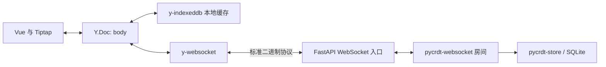

# DOM 协同编辑器：FastAPI 与现成库的精简方案

日期：2026-09-23。状态：用户已选择 Vue、FastAPI/Python、同段并发编辑，并确认保留离线编辑与本地刷新恢复；本文供 Claude 实施，尚未完成重构或兼容性实测。

本文替代 2026-09-21 的首版设计和自研协议路线。招聘截图中的可选功能不自动成为交付要求。配套实施步骤见 [实施计划](../plans/2026-09-23-fastapi-library-collaboration.md)，交接入口见 [Claude 交接说明](../../2026-09-23-claude-handoff.md)。

## 1. 目标与范围

做一个用户能理解、开发者容易 review 的简单协同编辑器。优先减少我们维护的协议、状态和抽象数量，保留必要的用户行为测试。

必须具备：

- 创建文档、复制链接、通过链接打开；不存在的文档不自动创建。
- DOM 渲染的普通段落编辑：输入、删除、Enter、Shift+Enter、跨段操作、纯文本粘贴与复制正文。
- 两个独立浏览器在同一段同时输入，最终内容一致；保留双方有效的并发修改。
- 本地撤销/重做不整体撤销另一人的编辑。
- 页面已加载时断线仍可编辑；重新联网后自动同步。
- 正常浏览器存储条件下，恢复已经写入本地缓存的内容；离线刷新以页面资源仍能加载为前提。
- 服务器自动持久化，重新启动后能恢复已写入数据库的内容。
- 清楚的连接/加载提示、必要的错误提示、可重复的启动与验收步骤。

本轮不做：自研 CRDT/OT、块锁、业务 Block ID、严格逐更新落盘 ACK、事务重放系统、历史版本、快照 UI、远端光标、在线名单、富文本工具栏、账号权限、多进程协作、Redis、消息队列、Service Worker。

## 2. 选型与职责

| 层 | 选型 | 我们保留的职责 |
| --- | --- | --- |
| 页面 | Vue 3 + TypeScript + Vite | 文档入口、路由、错误提示和简单连接状态 |
| 编辑器 | Tiptap / ProseMirror + Collaboration | 最小 schema、纯文本剪贴板、编辑器生命周期 |
| 并发模型 | Yjs 13；Python 对应 pycrdt | 使用统一的 `body` XmlFragment，不编写合并算法 |
| 浏览器同步 | y-websocket | 创建、订阅、销毁 provider，不编写网络协议与重试队列 |
| 本地缓存 | y-indexeddb | 缓存命名、等待恢复、初始化失败处理、销毁连接 |
| HTTP/WS 入口 | FastAPI + Uvicorn | 文档接口、文档存在性校验、应用生命周期 |
| 协作房间 | pycrdt-websocket | 少量房间创建/恢复接入，更新同步由库处理 |
| 持久化 | pycrdt-store / SQLiteYStore | 数据库路径、初次种子、恢复顺序和正常关机保存 |
| 文档目录 | Python sqlite3 | 仅保存 `documentId` 与 `createdAt`，不再保存应用事务 |

一个 Python 进程即可，不另加 Node.js 协作服务。FastAPI 不承担当字符合并或广播框架；通用库也不承担应用文档是否存在的判断。

## 3. 明确保存语义

这是普通自动保存与缓存方案，不承诺“每次输入都经过数据库提交确认后才通知浏览器”。

| 事件或状态 | 实际含义 | 不可据此宣称 |
| --- | --- | --- |
| WebSocket connected | 已建立连接 | 最近一次输入已保存 |
| y-websocket sync | 初始同步完成 | 每笔后续修改都已被服务器确认或落盘 |
| y-indexeddb synced / whenSynced | 本地已有内容已恢复 | 当前输入已写入磁盘 |
| 服务端 store.write 正常返回 | 对应写入已完成 | 更晚发生的输入也已保存 |

UI 主要显示“正在打开”“正在连接”“已连接”“连接中断，可继续编辑”；错误使用独立提示。取消旧“服务端已保存”、待确认事务数、技术事件面板。初始同步完成可用于开放编辑器，不能变成永久有效的保存凭证。

接受的边界：页面在本地写入完成前被强制结束、浏览器清除存储、设备磁盘故障、服务器在异步写入完成前崩溃，均可能影响最新修改。文档必须如实说明这些边界，不能写“刷新绝不丢内容”。数据库失败应记录并使相关房间停止正常服务/关闭连接，不允许吞掉错误继续展示健康服务。

若未来确需严格落盘回执，单独立项，不把旧 ACK/屏障系统带回本轮。

## 4. 文档、接口与存储

- 文档 ID 为 UUID，一个 ID 对应一个服务端房间与一个 Y.Doc；正文固定使用 `body`。
- schema 为 Document → Paragraph → Text / HardBreak；DOM 由 ProseMirror 管理。HTML 与 JSON 只用于展示或导出，不作为可继续协作的存储格式。
- 新文档由服务端生成唯一的空段落种子，先写入 CRDT 存储，再登记文档目录，成功后才返回链接。失败返回 503，不发布半初始化文档。
- 所有客户端从同一份种子恢复；禁止连接时调用 `setContent` 或重复插入示例段落。
- 文档目录与库的存储表分开管理：`backend/data/v2/documents.sqlite3` 存目录；`backend/data/v2/updates.sqlite3` 由 SQLiteYStore 管理。应用不读写库的内部表结构。
- 配置使用 `COLLAB_DATA_DIR` 指定该目录，数据库对象的路径在启动时固定；不逐请求改全局类属性。
- 浏览器缓存使用 `dom-collab-v2:<documentId>`。一份活动页面创建一份独立 Y.Doc，不复用持久化的 clientID。

| 入口 | 约定 |
| --- | --- |
| `GET /api/health` | 返回服务存活信息，不称其验证了全部文档的存储健康 |
| `POST /api/documents` | 成功 201：`{ documentId, createdAt }`；存储失败 503 |
| `GET /api/documents/{id}` | 存在时 200：同上；非法/不存在 ID 为 404；存储不可用 503 |
| `WS /ws/documents/{id}` | 标准 Yjs 二进制消息，不接受旧 JSON/Base64 信封 |

WS 在加入房间前验证 UUID 与目录；不存在时关闭并让 UI 明确停止此次打开流程。约定关闭码 4404 表示不存在，1013 表示暂时不可用；要向浏览器发送这类 WS 关闭码，错误分支先 accept 再 close，不创建房间、不进入 serve；不能在 accept 前 close 后误以为浏览器能收到 4404。前端显式处理 4404，不能只依赖特定版本库的默认重连策略。服务端房间键固定为规范化 UUID，避免 URL 前缀或查询参数造成重复房间。

默认开发端口保留前端 5273、后端 8787；测试端口保留 5473、8791。运行时只启一个 Uvicorn worker。

## 5. 必须正确接好的生命周期

### 服务器

1. FastAPI lifespan 创建文档目录、库的服务器对象和 task group；关闭时成对释放。不能假定 mount 子应用的 lifespan 会替父应用启动这些对象。
2. 同一个文档的首次打开只执行一次恢复，可用一个简单初始化锁；不再建立事务锁、候选文档克隆、序号队列。
3. 创建 `ready=False` 的房间，启动对应 store，加载已有 CRDT 状态，启动房间并设为 ready，等待 `ydoc_observed` 后才调用 serve。`ready=False` 只控制观察器，不会自动阻止 serve；接客顺序必须由接入代码保证。目录已有记录但库中没有数据时，视为存储错误；不得静默重新生成种子。
4. 使用库的标准 Channel/ASGI 接入能力，FastAPI 的 WS 入口只做校验和薄适配。协议消息的解析、合并、广播与 awareness 转发留给库。若使用 ASGIServer，由它执行 accept，不能在 FastAPI 层重复接受连接。
5. 明确设置 `auto_clean_rooms=False`。首版是少量文档的单进程演示；最后一个客户端离开时不立刻取消仍在进行的写入。
6. 正常停机先停止接客并结束现有消息处理，再对每个已加载文档执行一次有界等待的完整状态写入；完成后关闭 room/store/server。保存失败或超时要有日志与失败结果。正常停止必须实际触发并等待 FastAPI lifespan 退出；Windows 的 taskkill /F 或 Node child.kill 不能当作正常退出，强制杀进程不能依赖该流程。

### 浏览器

1. 每次打开创建 Y.Doc 与 y-indexeddb provider；同步 provider 先以 `connect: false` 创建。
2. 等待本地恢复；10 秒内未完成则给出“本地内容恢复失败，请重试”，不能无限等待 `whenSynced`。重试创建新会话，不复用半初始化对象。不读取 provider 的私有字段，也不增加第二份手写 IDB 日志。
3. 本地已有合法正文可在离线时挂载编辑器并继续写；冷启动没有正文时等待服务器种子，不能由编辑器先补空段落。
4. 恢复后连接 WebSocket；重连与差量同步交给 y-websocket。HTTP 校验、服务器错误不得在本地缓存存在时把内存正文清空。
5. 路由每次变化分配一个打开代次。旧异步打开结果不覆盖当前会话，并立即释放旧结果；EditorPane 用文档/会话身份作 key。
6. 关闭时先销毁编辑视图、撤销事件订阅，再销毁网络与缓存 provider，最后销毁 Y.Doc。不调用 `clearData`。缓存 provider 的 destroy 也可能等待尚未完成的数据库打开；路由切换不得被旧会话清理无限阻塞，先隔离旧回调，给异步清理设置上限并处理迟到完成。销毁不是逐更新持久化完成的证明。

浏览器缓存初始化失败与运行期间写入故障不是同一个事件。库没有承诺完整的逐笔故障回执；不得把 `whenSynced` 的超时处理包装成“所有本地写入故障已覆盖”。可检测的错误保留正文与复制出口，其余边界写入 README。

## 6. 最小文件边界与删除目标

| 文件 | 重构后职责 |
| --- | --- |
| `frontend/src/App.vue` | 页面入口与布局，不承载同步算法 |
| `frontend/src/documents/api.ts` | HTTP 文档接口 |
| `frontend/src/documents/session.ts` | 三个库对象的生命周期和简单连接状态 |
| `frontend/src/editor/EditorPane.vue` | 编辑器实例、剪贴板、撤销/重做 |
| `frontend/src/editor/extensions.ts` | 最小编辑 schema 与 Collaboration |
| `backend/app/main.py` | 应用工厂、lifespan、HTTP 与 WS 路由 |
| `backend/app/documents.py` | 文档目录的创建/查询、服务端种子构造 |
| `backend/app/collaboration.py` | 现成 room/store 的初始化、恢复、关闭与 WS 薄适配 |

接入验证通过后删除旧客户端 `collab/provider.ts`、`journal.ts`、`protocol.ts`、`save-state.ts`，以及旧服务端 `protocol.py`、`room.py`、`store.py`、`crdt.py`，把仍必要的小段职责移入上表。不要只重命名旧状态机或把它包在新库外面。

不新建通用 Repository、EventBus、插件框架、策略工厂或多套 session/context/manager。按责任分文件，不为每个类和类型建立单独文件。注释解释设计与边界，不逐行讲解语言语法。

## 7. 兼容与旧数据

已有实现位于 `F:\基于DOM的协作编辑器\.claude\worktrees\confident-mclaren-506b7a`，分支 `claude/confident-mclaren-506b7a`，基线提交 `ecd7433`；项目根目录 main 目前只有方案。

实施前检查实际工作树和未提交修改。已知 `frontend/src/collab/protocol.ts` 有用户未提交的注释修改：先保存可恢复副本，再删除被替代文件；不得覆盖、丢弃或顺手提交该修改。

新旧 WebSocket 协议不兼容，切换后应关闭旧页面并刷新。新版本使用独立数据库与缓存命名空间，默认不迁移旧演示数据，旧链接不自动变成新文档。旧数据库和浏览器缓存全部保留，禁止自动删除；如需沿用旧文档另做迁移，不在本次重构中暗改数据格式。

## 8. 验收依据

| 编号 | 场景 | 成功条件 |
| --- | --- | --- |
| A1 | 新建、两个浏览器打开、刷新 | 只有一份初始空段落，文档 ID 和正文一致 |
| A2 | 同段并发插入；插入与删除交叉 | 独立浏览器上下文通过真实 Python WS 通信，双方最终一致 |
| A3 | 回车、段内换行、跨段删除、粘贴、复制 | 结构有效；明确取 text/plain；复制保留 HardBreak |
| A4 | 本地撤销/重做期间有远端编辑 | 不整体撤销对方内容 |
| A5 | 两端离线编辑，再连接 | 两端新增被保留；仅删除的更新也会传播 |
| A6 | 只阻断 WS，页面资源可加载，离线刷新 | 已写入缓存的正文恢复，重连后与另一端一致 |
| A7 | 最后一页关闭后正常停服；已提交后强制结束并重启 | 无旧浏览器补传时，新上下文仍读到数据库已有内容；超过 100 次更新后也成立 |
| A8 | 服务端存储失败；本地恢复失败/超时 | 不伪报已保存，不清正文，不无限 loading，有可操作提示 |
| A9 | 快速 A→B 切换、关闭页面、不同文档 | 不串会话、复制正确正文、旧订阅不继续工作、文档隔离 |
| A10 | 同源两页并发 | 不重复正文；另外用关闭 BroadcastChannel 的测试确认 Python 路径 |

测试等待可观察条件，不以固定 sleep 代表落盘。A6 等独立读取缓存可恢复目标内容；A7 在测试进程用官方 store 读取验证写入，不能用 UI connected/synced 作为完成依据。首版不保证未写入更新在强制崩溃后恢复。

真实系统中文输入法另做人工验收：组合输入时有远端插入/删除、候选上屏、撤销重做与断线重连。未实际执行就标“未执行”，不能用 keyboard.type 替代。

## 9. 官方依据与待验证项

- [y-websocket](https://github.com/yjs/y-websocket)：稳定包配 Yjs 13；网络同步与重连。
- [y-indexeddb](https://docs.yjs.dev/ecosystem/database-provider/y-indexeddb)：本地缓存；synced 是初始恢复事件。
- [pycrdt-websocket 发布记录](https://github.com/y-crdt/pycrdt-websocket/blob/main/CHANGELOG.md)：0.16 起 store 拆为独立包，注意新旧导入路径。
- [YRoom 实现](https://github.com/y-crdt/pycrdt-websocket/blob/main/src/pycrdt/websocket/yroom.py)：广播与写入异步调度，stop 不能当作写入排空。
- [SQLiteYStore](https://github.com/y-crdt/pycrdt-store/blob/main/src/pycrdt/store/sqlite.py)：恢复与写入 API，不直接操作其内部表。

资料核实不等于运行验证。实施第一步必须验证锁定版本在本机 Windows/Python 环境中的真实互通、持久化与正常关闭，再大规模替换旧实现。
